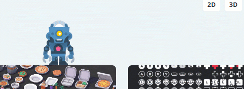
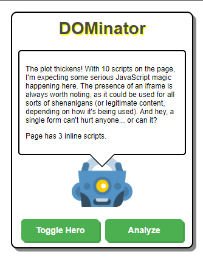

# DOMinator

DOMinator is a browser extension that combines fun with functionality. It's your friendly neighborhood DOM analyzer and web security sidekick, designed to help developers and security enthusiasts explore web pages in a unique and interactive way.

<center>




</center>

## Features

- **Interactive Character**: A cute pixel art character that roams around web pages, interacting with the DOM elements.
- **DOM Analysis**: Analyzes the Document Object Model (DOM) of web pages for potential security issues and interesting features.
- **Platform Detection**: Identifies visible elements on the page that can act as platforms for the character to interact with.
- **Customizable Behavior**: Adjust the character's speed and jump height to suit your preference.
- **Real-time Feedback**: Provides instant feedback about the page's structure and potential security concerns.

## How It Works

1. **Character Creation**: When activated, DOMinator injects a pixel art character into the current web page.
2. **DOM Interaction**: The character can walk, run, and jump around the page, interacting with detected platform elements.
3. **Page Analysis**: As the character moves, it analyzes the page's DOM structure, looking for potential security issues and interesting features.
4. **Real-time Reporting**: Analysis results are displayed in a speech bubble above the character, providing instant feedback to the user.
5. **Dynamic Adaptation**: The character adjusts to page scrolling and window resizing, ensuring it stays visible and functional.

## Installation

1. Build the extension:
```bash
git clone https://github.com/DaveTacker/dominator
cd dominator
npm install
npm run watch # or 'npm run build'
```

2. Load the extension in your browser:
   - Open Chrome and navigate to `chrome://extensions`
   - Enable "Developer mode"
   - Click "Load unpacked" and select the `browsers/chrome` directory in your project folder


## Usage

1. Click the DOMinator icon in your browser toolbar to activate the extension on the current page.
2. Watch as the pixel art character appears and begins to explore the page.
3. Observe the character's interactions with page elements and read the analysis results in its speech bubble.
4. Use the options page to customize the character's behavior:
   - Adjust speed (slow, normal, fast)
   - Modify jump height (low, normal, high)

## Using a LLM

This project's `docker-compose.yaml` comes with a Python server and ollama, a locally hosted LLM. To use it, follow these steps:

```bash
docker compose build
docker compose up -d
```

Then navigate to the extension options by right-clicking the extension icon and selecting "Options". In the "API" section you can specify the URL of the LLM server, your API key, and what model you want to use.

## Contributing

Contributions are welcome! Please feel free to submit a Pull Request.

## License

This project is licensed under the MIT License - see the [LICENSE.md](LICENSE.md) file for details.

## Acknowledgments

- Pixel art character inspired assets provided by [Kenney.nl](https://kenney.nl/assets).
